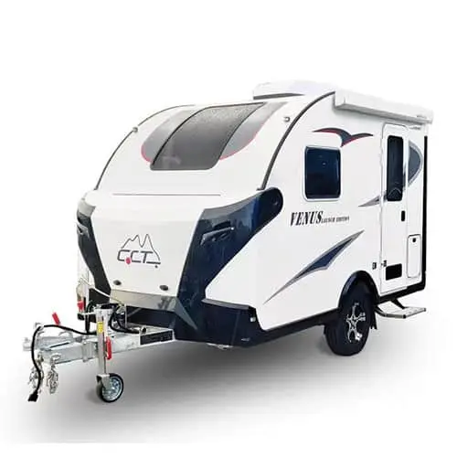

+++
date = '2026-01-04T18:07:18+10:00'
draft = false
title = 'Retirement Caravan Options'
tags = ['retirement-darrell']
comments = true
+++

In the interests of going in eyes wide open I feel some time spent planning is in order apropo my retirement.  First up I'll look at costs and realities of buying a caravan in Australia. I'll then look at the same scenario in New Zealand.  The caravan option is the only one short of council flat/appartment or retirement home.  I hope to be in rugged health into my seventies so this option will hopefully hold out as the best for independence and mobility.

Some pre-requisites...
- must be towable by a sedan (e.g., Mitsubishi Lancer) so ATM cannot exceed brake towing limit of 1000kg.
- initial budget is $AU25k including onroad costs (rego, stamp duty etc)
- ideally should include AirCon/Heating and toilet/shower.
- should be available in Sunshine Coast or within 100km from Amamoor, QLD.

### New Caravans
---
#### CCT Venus 11m

The [Venus 11ft Caravan](https://centurytrailers.com.au/product/venus11_caravan/) by CCT (Coopers Caravans) is the first off the rank.  Yesssss it still has the ChatGPT referal in the URL - call me lazy.  OK, at $AU 32,298 it's quite a bit over budget.  It **does** however tick all of the boxes for including AC, including all onroad costs, available withi 100km but does **not** come within the ATM limit of 1000kg (ATM 1500kg).

> 
> [!CAUTION] ok, so turns out buying a caravan new that conforms to my pre-requisites is crazy talk.  I need to revisit this armed with knowledge :)
>

### NZ Made Teardrops

#### Bubble Caravans - SoCute Teardrop

{{< carousel images="so-cute-teardrop-1.jpg,so-cute-teardrop-2.jpg,so-cute-teardrop-3.jpg,so-cute-teardrop-4.jpg,so-cute-teardrop-5.jpg,so-cute-teardrop-6.jpg,so-cute-teardrop-7.jpg,so-cute-teardrop-8.jpg,so-cute-teardrop-9.jpg}" >}}

[bubble caravans so cute teardrop camper](https://bubblecaravans.co.nz/the-so-cute/)

Have emailed manufacturers asking for quote and few other things.  If this little gem falls under $NZ30k then it will be a strong contender for NZ retirement.  Great price for included features[^1].  None of the BS Australian manufacturers get into about this and that is an optional extra (on top of high prices IMHO).  Looks gorgeous and is practical from what I can see for a solo traveller of advancing years. :older_man: Has a GVM of 1250.

>
> "None of the BS Australian manufacturers get into..."
>

Update: The retail price at 2026 for this model with all features is $65k.  Bugger!

Quick glance at TradeMe had Mistsubishi Outlander 2010 Petrol 4x4 Auto at $4k.  Towing cap 2000kg.

[^1]: Built in shower and cassette toilet, double bed, 85l fridge/freezer, kitchen sink, braking system, gas bottle, gas stove (exterior), running hot water, outside shower(?).