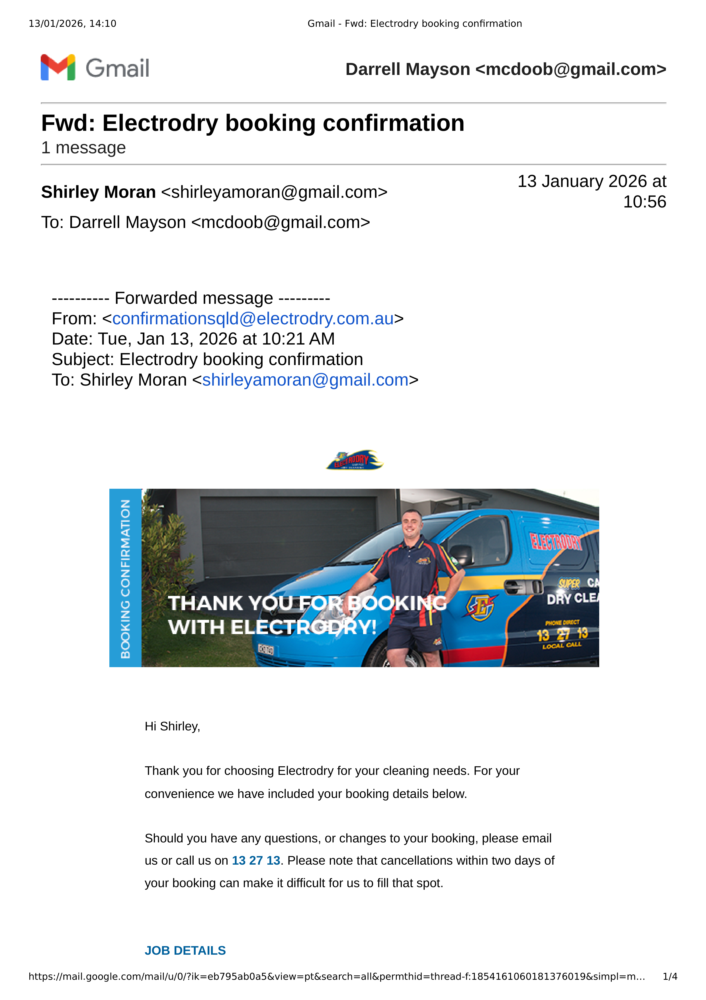
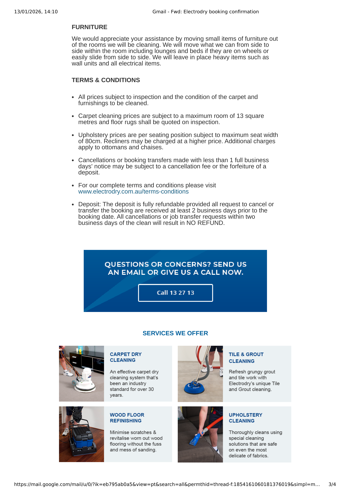

### Nurse Joan from Nambour Hospital

Mum just called to say she was on the phone with a community nurse from Nambour Hospital and could she give her my phone number for her to call me in the next day or two?  Her name is **Joan**.  It was a follow up call after operation.  There is a facility at hospital if you feel you need further care - mum said she didn't feel she needed this and went on to say that she spoke with Joan for some time.  I said I was more than happy to have a chat with Joan.

### Electrodry

Mum also mentioned that an outfit called 'Electrodry' are coming tomorrow to clean the carpets in the 3 x bedrooms plus the lounge.  They will also clean two chairs in lounge and the 2 x aircon units.  They said that thier cleaning does erradicate mites.  Mum texted this morning (13Jan26) asking me to come around and take 3 x toppers to laungry as they had been soiled by BJ overnight (?).

>
>[!warning] Also discovered that Tom from Electrodry had texted mum to say his technician had a emergecy in the family so could not attend today (13Jan26).
>

Mum is in the habit of leaving phone unattended and not keeping track of messages.  Called Electrodry bacl using phone number on website.  After convincing woman on end of call that we **did** have a booking (and after a little static around usually needing weks in advance booking) was able to get a Sat morning booking for 0730hr Sat 17Jan26.  She was even magnanimous enough to wave the usual $15 Sat surcharge - something I suggested was appropriate since **they** dropped the ball and **we** were calling them to arrange new date and time :roll_eyes:

Mum and BJ were there during call and okayed new date and time.

>
>[!danger] Mum has disclosed credit card details inluding CTC number to this outfit.  Advised her **again** not a good practice to be doing this.  In future forward details to me to arrange deposits and payments that are a lot less risky!
>

Place sounded a bit __off__ but will just have to watch and see.  Sounds like technician will have eftpos on day and expect payment of remaining charge per attached invoice/quote.

