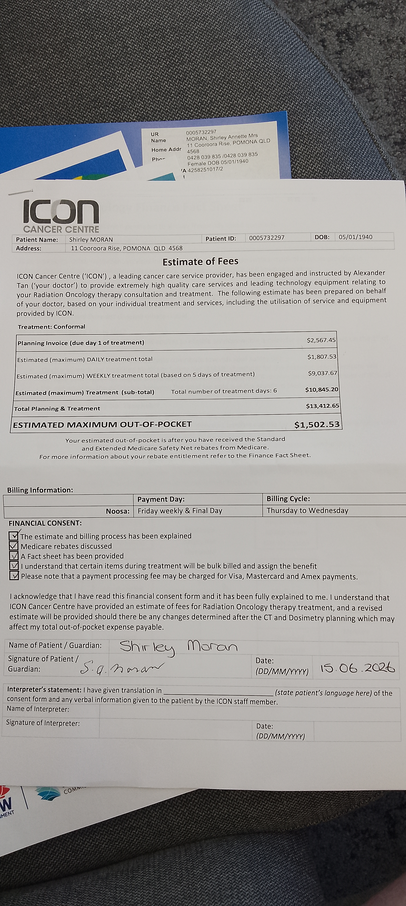



First visit with Dr.Tan.  Radiation treatment in Australia relatively new but has been around elsewhere for some years (especially Germany).  Low dosage radiation on knee.  2 x sessions per week for 3 x weeks, Mon and Thurs mornings between 8am - 11am.  Check in with Nurses once week check progress answer questions.  Check in with Dr.Tan after first week free of charge (bulk billed) for same.

Mum had initial MRI (CT?) scan today at Sunshine Coast Radiology.  First radiation treatment Thurs 18Jun at 1pm then MOn and Thurs AM fro following week onwards.

After 3 months return visit to Dr.Tan to assess progress/improvement ($90).

Attached fee estimates.  Payments billed weekly dependent on visits that week.

