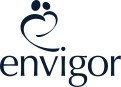

## 11Jun

Mark visited mum and BJ this morning to discuss current setup with Silverchain and current needs.  All with a view to better addressing needs with new provider.

I spoke breifly with Mark over the phone and emailed him the April & March Activity Statements from SC along with confirmation of care package increasing to Level 3.

## 12Jun

Spoke over the phone at length with Mark outlining mum and BJ's health needs and current concerns.  Confirmed that Mark works for Envigor which is a service provider.  Mark promoted some 'Blue Programme' or such which is aimed at providing a structured training programme (including videos?) for regular physio exercises which are monitored by staff.  Can't see how this is an improvement on the one-on-one physio mum gets now.

Asked Mark to put together an **easily consumed** folder with material utlining onboarding and how his organisation manages it's clients [better then Silverchair does] - communications, proactivity, care, access to funds etc.

Asked Mark to stay in touch with mum & I.

Spoke with mum after call and we agree there does not appear to be much difference between what Envigor is offering and what SC currently offers - they are both subject to the same government rules and there does not appear to be a clear benefit in moving to the new outfit.  We'll hear them out anyway and make an informed decision.

>
> [!NOTE] Asked Mark to put together an **easily consumed** folder with material utlining onboarding and how his organisation manages it's clients
>

## 14Jun

Have looked over the Envigor website and can see no notable difference in approach to Silverchain.
One page that stood out as potentially useful was the one title ['Understanding the Support at Home Program: Your simple guide'](https://envigor.com.au/blog/understanding-support-at-home/)

