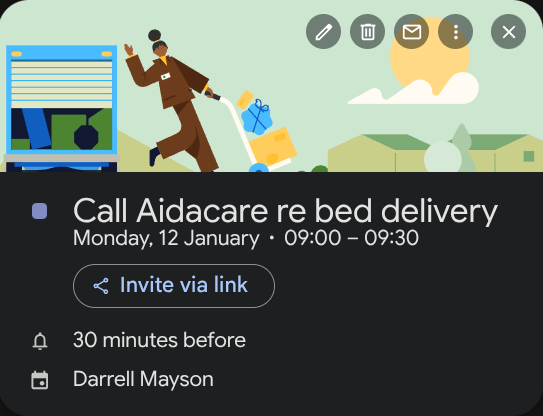

# This post looks at 2 x issues.

## Mum's mystery arm bruise & mechanical bed follow up.

### Call Aidacare (ne Lakeside Mobility) re bed delivery eta.

Purchase was made 22Dec25 at BIRTINYA branch Lakeside Mobility.
>
>[!NOTE] Called Lakeside Mobilty 12Jan26 - they will organise urgent delivery.
>

### What's going on with this bruise on mum's forearm?

It has now been 10 days and the bruise is now extending around the arm.  It is a purple blue black on the top but a more faded green on the underside. There is still a slightly raised centre and it is tender to the touch.  It is also warmer than the surrounding skin (infection? - my note)  Checked with pharmacist in Cooroy Sat morning and she provided a cooling cream which will help reduce bruising.  Mum's last visit to Desh his advice was it was nothing to worry about :smirk: :roll_eyes:

>
>[!NOTE]I still have concerns that it is a break or bite but I have to defer to specialists.  Ana doesn't think it's a break and she's a physiotherapist.  Desh is a skin specialist so surely he would know if it were a bite or break!
>